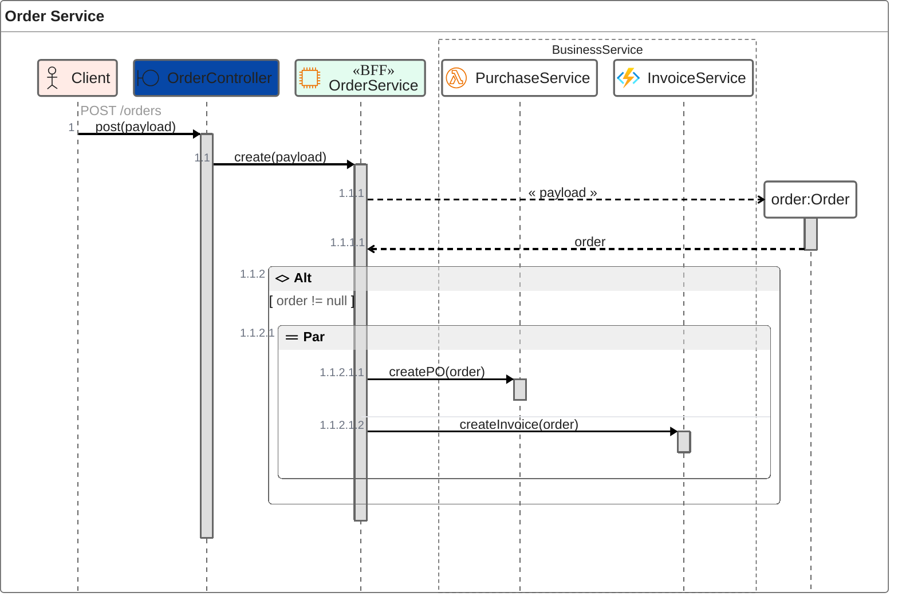

```mermaid
zenuml
    title Order Service
    @Actor Client #FFEBE6
    @Boundary OrderController #0747A6
    @EC2 <<BFF>> OrderService #E3FCEF
    group BusinessService {
      @Lambda PurchaseService
      @AzureFunction InvoiceService
    }

    @Starter(Client)
    // `POST /orders`
    OrderController.post(payload) {
      OrderService.create(payload) {
        order = new Order(payload)
        if(order != null) {
          par {
            PurchaseService.createPO(order)
            InvoiceService.createInvoice(order)      
          }      
        }
      }
    }		
	  
```